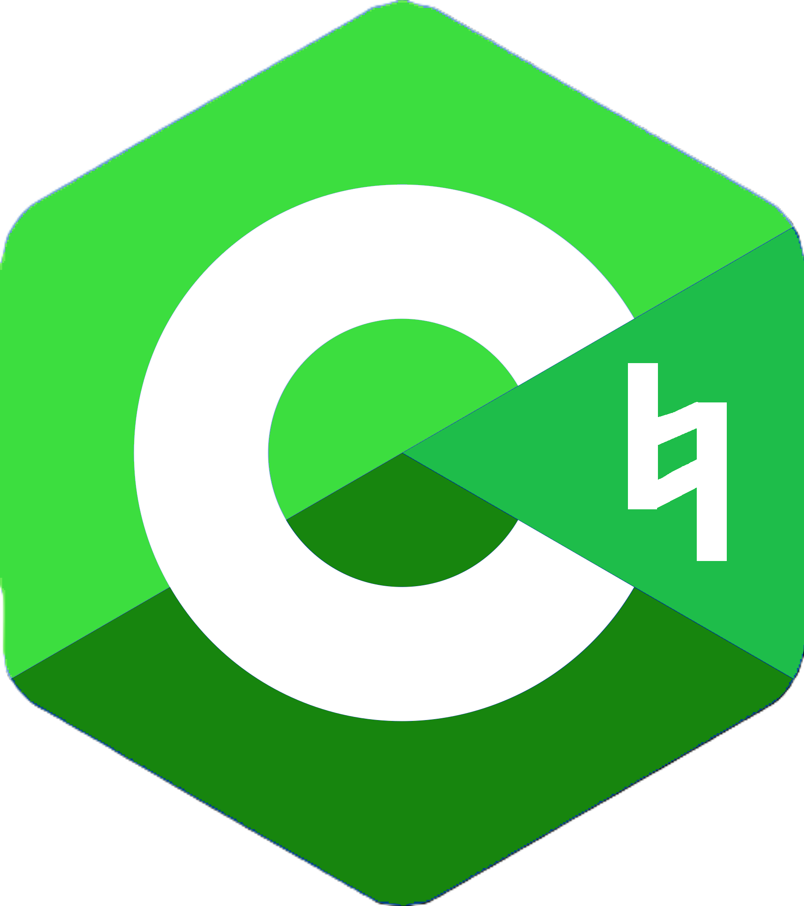

# The C♮ Programming Language



The C♮(<i>Pronounced: C Natural</i>) programming language is a modern C-like language with a minimal compiler and a C inspired syntax. C♮ compiles to native machine code, but it needs the help of a C compiler to do that. <br>
**Build**<br>
Clone this repository, and compile `cnc.c` into an executable called `cnc`, using a C compiler of your choice.<br>
**Hello World**<br>
Create a file called `hello.cn` and write:
```cn
void main() {
	printf("Hello World!\n");
}
```
To compile this file, run:
```bash
cnc gcc hello.cn
```
If everything is done correctly, you should see an executable in the same directory.<br>
You can use another C compiler other than `gcc` if you want (such as `clang`)
